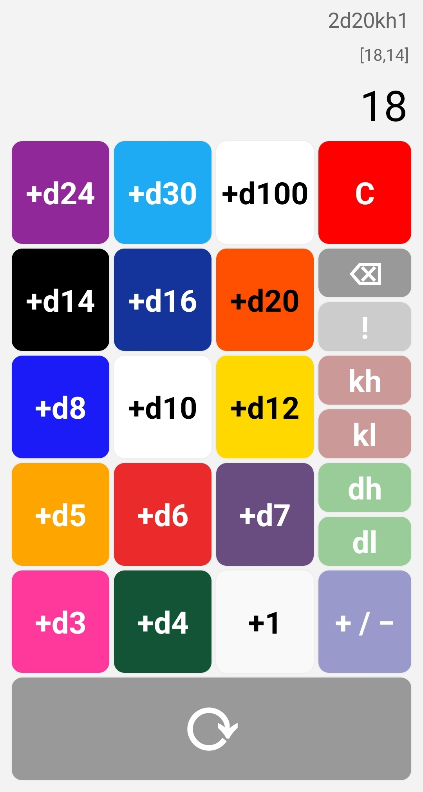

# Diceriffic #

Diceriffic is a polyhedral dice rolling app built to function like a simple calculator. You both roll and build up your dice "equation" simultaneously by tapping the appropriate buttons.

## Usage ##

### Basics ###

Tap a die button (+dX) to roll a die with X sides. Every time you tap a die button another die will be rolled and added to your running total.

*Example:* If you wanted to roll `4d6`, simply tap (+d6) four times.

### Constant Modifiers ###

Tap the modifier button (+1) to add a constant +1 modifier to your dice roll. To get a larger modifier, simply keep tapping (+1).

*Example:* If you wanted to add `+4`, simply tap (+1) four times.

### Sign Change ###

If you want to subtract a die or modifier (rather than add it), you can tap the sign button (+/−) to switch the sign before tapping the die or modifier button.

### Re-rolling ###

You can tap the reroll button (⟳) to re-roll the dice you've previously selected.

### Clearing ###

Tap the clear button (C) to clear your rolls and start over.

### Deleting ###

Tap the delete button (⌫) to remove the last part of the dice equation.

*Example:* You tapped (+d10) then (+d20) (+d20), giving you `1d10 + 1d20`. Tapping (⌫) will delete the `2d20`.

### Other Operators ###

Diceriffic contains 5 other operators that can be added to a roll of dice.

#### Explode ####

Tapping the explode button (!/!!) to make dice rolls "explode", i.e., when the highest number possible is rolled, the die gets rolled again.

*Example:* You tapped 4x (+d6) and (!), for an equation of `4d6!` and the rolls `[4,(6,5),3,(6,4)]`. The original four rolls were 4, 6, 3, and 6. For each 6, the die was rolled again (grouped in the parentheses) for an extra 5 and 4, for a total of `28`.

Tapping the explode button more than once will toggle the equation between normal explodes `!` and "compound explodes" `!!`, where grouped dice are added together into a single result.

*Example:* You tapped 4x (+d6) and 2x (!), for an equation of `4d6!!` and the rolls `[4,(11),3,(10)]`. The original four rolls were 4, 6, 3, and 6. For each 6, the die was rolled again (grouped in the parentheses) for an extra 5 and 4, and those groups were subtotaled into `11` and `10`. The overall total remains `28`.

#### Keep Highest ####

Tapping the keep highest button (kh) will keep the highest remaining roll, discarding the others. You may keep tapping the keep highest button to keep more of the original results.

*Example:* You tapped 4x (+d6) and (kh), for an equation of `4d6kh1` and the rolls `[1,4,5,3]`. Since 5 was the highest roll, the total will be `5`. If you tap keep highest again, you'll change the equation to `4d6kh2` and increase the total to `9` as now both the 5 and 4 rolls are being kept.

#### Keep Lowest ####

Tapping the keep lowest button (kl) will keep the lowest remaining roll, discarding the others. You may keep tapping the keep lowest button to keep more of the original results.

*Example:* You tapped 4x (+d6) and (kl), for an equation of `4d6kl1` and the rolls `[1,4,5,3]`. Since 1 was the lowest roll, the total will be `1`. If you tap keep lowest again, you'll change the equation to `4d6kl2` and increase the total to `4` as now both the 1 and 3 rolls are being kept.

#### Drop Highest ####

Tapping the drop highest button (dh) will drop the highest remaining roll, keeping the others. You may keep tapping the drop highest button to drop more of the original results.

*Example:* You tapped 4x (+d6) and (dh), for an equation of `4d6dh1` and the rolls `[1,4,5,3]`. Since 5 was the highest roll, the total will be reduced from `13` to `8`. If you tap drop highest again, you'll change the equation to `4d6dh2` and decrease the total further to `4` as now both the 5 and 4 rolls are being dropped.

#### Drop Lowest ####

Tapping the drop lowest button (dl) will drop the lowest remaining roll, keeping the others. You may keep tapping the drop lowest button to drop more of the original results.

*Example:* You tapped 4x (+d6) and (dl), for an equation of `4d6dl1` and the rolls `[1,4,5,3]`. Since 1 was the highest roll, the total will be reduced from `13` to `12`. If you tap drop lowest again, you'll change the equation to `4d6dl2` and decrease the total further to `9` as now both the 1 and 3 rolls are being dropped.

#### Count Target GTE ####

Tapping the target gte button (≥) will, instead of adding the rolls, count the rolls greater than or equal to the target number. You may keep tapping the target gte button to increase the target.

*Example:* You tapped 4x (+d6) and (≥), for an equation of `4d6≥1` and the rolls `[1,4,5,3]`. Since all four rolls are greater than or equal to 1, the total will `4`. If you tap target gte again, you'll change the equation to `4d6≥2` and decrease the total to `3` as now only three rolls are greater than or equal to 2.

**Note:** When counting targets, any constant modifier will be added to *each* roll before counting, rather than only once to the final total.

#### Count Target LTE ####

Tapping the target lte button (≤) will, instead of adding the rolls, count the rolls less than or equal to the target number. You may keep tapping the target lte button to increase the target.

*Example:* You tapped 4x (+d6) and (≤), for an equation of `4d6≤1` and the rolls `[1,4,5,3]`. Since only one roll is less than or equal to 1, the total will `1`. If you tap target lte again twice, you'll change the equation to `4d6≤3` and increase the total to `2` as now there are two rolls less than or equal to 3.

**Note:** When counting targets, any constant modifier will be added to *each* roll before counting, rather than only once to the final total.

## Errata ##

Diceriffic is open-source under the MIT license.

Copyright (c) 2024 Jon Thysell
